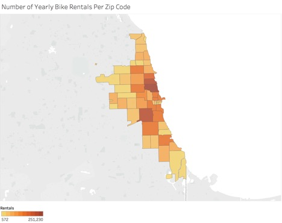
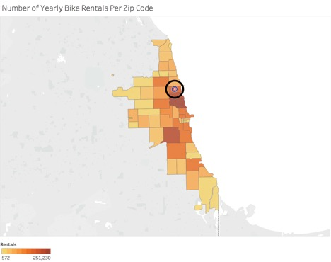
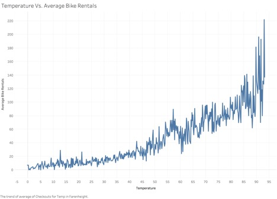
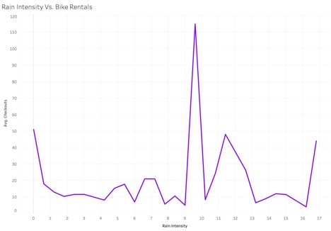
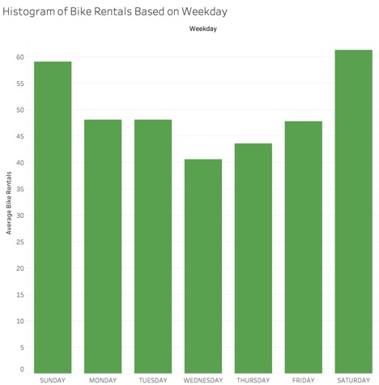
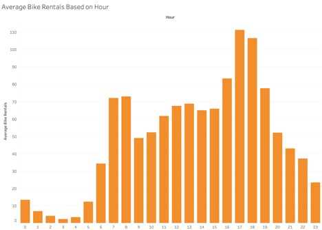
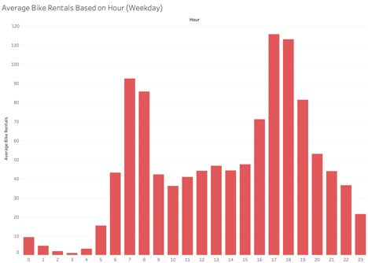
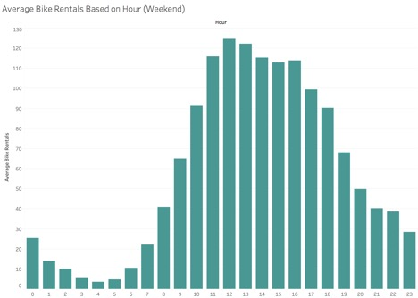

```{r setup, include=FALSE}
knitr::opts_chunk$set(echo = TRUE)
```

```{r Packages Required, include=FALSE}
require(boot)
require(glmnet)
require(MASS)
require(pscl)
require(randomForest)
```

```{r, echo=FALSE}
# helper function to determine if a cubs game is happening within an 8 hour time radius 
game_soon <- function(game_type, hour){
 
  ret_vec <- c()
  len_game_type <- length(game_type)
  for(i in 1:len_game_type){
    if(game_type[i] == 'N' && hour[i] >= 16){ 
      ret_vec <- c(ret_vec, 1)
    }
    else if(game_type[i] == 'D' && hour[i] >= 10 && hour[i] <= 17){
      ret_vec <- c(ret_vec, 1)
    }
    else{
      ret_vec <- c(ret_vec, 0)
    }
  }
  return(ret_vec)
}
```

```{r, echo=FALSE}
# helper function to determine if the day of the week is a weekend or a weekday
isWeekend <- function(days_of_week){
  
  bin_weekend_vec <- c()
  num_days <- length(days_of_week)
  for(i in 1:num_days){
  
  if(days_of_week[i] == "SATURDAY" || days_of_week[i] == "SUNDAY"){
    
    bin_weekend_vec <- c(bin_weekend_vec, 1)
    
  }else{
    
    bin_weekend_vec <- c(bin_weekend_vec, 0)
    
  }
  } 
  return(bin_weekend_vec)
}
```

```{r, echo=FALSE}
# helper function to determine if it is raining based upon the intensity of the rain
isRaining <- function(rain_vec){
  
  len_rain_vec <- length(rain_vec)
  rain_bin <- c()
  for(i in 1:len_rain_vec){
    
    if(rain_vec[i] > 0){
      
      rain_bin <- c(rain_bin, 1)
      
    }else{
      
      rain_bin <- c(rain_bin, 0)
      
    }
  }
  return(rain_bin)
}
```

```{r, echo=FALSE}
# Loads in all data
wrigley_agg <- read.csv("../data/divvy_data.csv", header = TRUE)
game_vec <- wrigley_agg$Cubs_Game
hour_vec <- wrigley_agg$Hour
new_column <- game_soon(game_vec, hour_vec)
wrigley_agg$Game_Soon <- new_column
weekend_vec <- isWeekend(wrigley_agg$Weekday)
wrigley_agg$Weekend <- weekend_vec
new_rain_col <- isRaining(wrigley_agg$Rain_Intensity)
wrigley_agg$Rain_Pouring <- new_rain_col
```

  Divvy bike is Chicago’s bike sharing system. Through this system, riders can rent bikes for limited periods of
  time and pay for the length of their rental. One of Divvy Bike’s greatest challenges is effectively meeting
  demand. In order to respond to this, Divvy Bike has to be prepared for spikes in the demand for bikes at
  stations around the city. Particularly, they have to be able to transport bikes from areas of low demand from
  areas of high demand. To deal with the entirety of this problem, Divvy would need to build a model of bike
  returns and bike rentals. In this analysis, I simply create a model of bike rentals, because a simple
  extension of the model to bike returns would allow Divvy to complete their analysis. 

To create this model, I combined data from three separate sources. 

  (1)	Divvy Bike’s Data about each rider. https://www.divvybikes.com/system-data
  (2)	The Cubs schedule. https://www.baseball-reference.com/teams/CHC/2016-schedule-scores.shtml
  (3)	Chicago Weather Data. https://catalog.data.gov/dataset/beach-weather-stations-automated-sensors

This model is created as a proof of concept that Divvy can use data about local events and weather throughout
Chicago to make more accurate predictions of excess demand. 

The datasets were aggregated and combined into 7515 data points consisting of the following fields.

•	Checkouts: The number of bikes rented in a given hour in a 1.5 mile radius around Wrigley Field. 

•	Temp: The temperature in Celsius.

•	Humidity: The relative humidity in the air.

•	Rain_Intensity: The Millimeters of rain that fall per hour.  

•	Rain_Total: (This dimension was not made clear in the dataset, so it was excluded from analysis)

•	Hour: Hour of the day ranging from 0-23.

•	DOY: Day of the year ranging from 1 to 365.

•	Weekday: The Day of the Week.

•	Cubs_Game: Categorical variable that indicates if a Cubs Game is happening that day at night (N), during the
day (D), or not at all/away game (X).

  Along with the following engineered fields created during analysis:

•	Rain_Pouring: Categorical variable that takes on the value 1 if the rain intensity is non-zero and takes on
the value 0 otherwise.

•	Game_Soon: Categorical variable that is 1 if there is a cubs home game happening between hour 10 and 17
(inclusive) if it is a day game or between hour 16 and 23 (inclusive) if it is a night came, and 0 otherwise.

•	Weekend: Categorical variable that is 1 if the day of the week is a weekend and 0 otherwise. 

  This data is recorded for every hour of 2016, but some data points had missing weather values, which is why
  the total number of points is only 7515.

Overview of the Data:

  Below are heat maps detailing the number of bikes rented around Chicago. The second map contains the area
  discussed in this data analysis.

```{r echo=FALSE, out.width='100%'}

```

```{r echo=FALSE, out.width='100%'}

```

Weather Effects

Temperature was a very important factor in determining the number of bike rentals. It is apparent in the graph
below that temperature and the average number of bike rentals have a relatively linear relationship.

```{r echo=FALSE, out.width='100%'}

```

Specifically, for every 1 degree increase in temperature, about 2.5 more bikes are rented per hour, as can be seen in the linear regression.
  
```{r}
temp_lm <- lm(Checkouts ~ Temp, data = wrigley_agg)
summary(temp_lm)
```

  The rain also has a substantial effect upon the number of individuals who decide to rent bikes. In our
dataset, there seemed to be a number of outliers that were likely due to some sort of measurement error. The
weather data came from Oak Street Beach, which is about 4 miles from Wrigley Field. If there were local
variations in the weather, then this could have caused some of the strange effects we see. Below is the graph
of rain intensity vs. the number of bike rentals. 

```{r echo=FALSE, out.width='100%'}

```

  We cannot fairly exclude these outliers, because we don’t know where they come from. However, we can transform
the data to just use a variable that determines if it is raining at all to make a prediction. If we look at
the average number of bikes rented when it is raining as opposed to when it is not raining, we see a clear
trend. About 35 more bikes are rented on average when it is not raining.
  
Time Effects

  The day of the week is another very important factor in determining the number of riders within an hour. As
expected, far more people rent bikes on the weekend than any other day of the week. On an average weekend day,
about 15 more bikes are rented than an average weekday. However, there is some variation on weekdays
themselves. Specifically, Wednesday and Thursday see substantial drops in the number of bikes that are rented.
It is unclear why this is true. 

```{r echo=FALSE, out.width='100%'}

```

  The hour of the day also has a strong influence upon the number of bikes that are rented per hour. However,
  this effect is a bit more difficult to model because the effect is highly non-linear. The overall distribution
  of average bike rentals is shown below.

```{r echo=FALSE, out.width='100%'}

```

  The relationship between the hour of the day and the number of bike checkouts is clearly non-linear. However,
  the above graph, since it is merely an average over an entire week, does not tell the whole story. The day of
  the week is very influential upon what hours people rent bikes. The distribution of bike rentals on weekdays
  is shown below. It is clear that around 7-8 AM and 5-6 PM are the peak hours of bike riding, and that there is
  a substantial drop in the middle of the day. This can likely be attributed to the fact that most people work
  on the weekdays. 

```{r echo=FALSE, out.width='100%'}

```

  However, the distribution of bike rentals per hour looks much different on the weekend days. Here, the peak
  bike rental time are at 12-1 PM and there is no drop in the middle of the day. This interaction between the
  day of the week and the hour of the day is accounted for in our model. 

```{r echo=FALSE, out.width='100%'}

```

Cubs Games

A large part of this study is focusing on how to make better predictions for the demand for Divvy Bikes based
upon data about local events in the City. In Wrigleyville, a main and recurrent event is Cubs games. We wanted
to investigate how much of an effect a Cubs game occurring within an 8 hour window would have upon the demand
for Divvy Bikes. Because Cubs games are correlated with nicer weather and more reasonable times of the day for
bikers to be riding, it is difficult to isolate the effect of the Cubs playing without a more advanced
sampling technique. Instead, we can look at the results of predictive models to see how important cubs games
are in predicting bike demand. 

  Now, it is clear which factors in the data effect the number of bikes that are checked out. The key is to make
  a model that captures these relationships without overfitting the noise.

The point of the predictive analysis is to build the most accurate predictive model, meansured by 10-fold
cross-validated mean-squared error of the number of bikes rented around Wrigley Field in any given hour. 

First, we'll try to build a basic linear model to fit the data. Because the data consists of counts, we already
know that this is likely not the best fit, because basic linear regression will sometimes predict negative
values.

```{r Basic Linear Model}
basic_linear_1 <- glm(Checkouts ~ Weekday + Game_Soon + Hour + Temp + Humidity + Rain_Pouring + DOY, data = wrigley_agg)

cv_linear_1 <- cv.glm(wrigley_agg, basic_linear_1, K = 10)
summary(basic_linear_1)
print(cv_linear_1$delta) #outputs the mean squared error from 10-fold cross validation
```

While many of the coefficients have highly significant predictors, the model doesn't perform too well. This is not surprising given the exploratory data analysis, where we uncovered that the day of the year and the hour of the day affect the number of bikes checked out in a non-linear fashion. Using this, we will try to create a better linear model, transforming the variables.

```{r Advanced Linear Model}
basic_linear_2 <- glm(Checkouts ~ Game_Soon + Weekend + poly(Hour, 6):Weekend + poly(Hour, 6) + Temp + Rain_Pouring + poly(DOY, 5), data = wrigley_agg)

cv_linear_2 <- cv.glm(wrigley_agg, basic_linear_2, K = 10)
summary(basic_linear_2)
print(cv_linear_2$delta) #outputs the mean squared error from 10-fold cross validation
```

Here, we get a substantially better fit from the modifications from the formula. Taking these factors into account lead to all significant predictors and a much lower MSE. 

Now, we will try some models that may be more appripriate for count data. First, we will try a poisson regression model. We will log transform the Temperature since in this model the response is log transformed, so predictors that have a strong linear relationship with the response should also be log transformed.

```{r Poisson Model}
basic_poisson <- glm(Checkouts ~ Game_Soon + Weekend + poly(Hour, 6):Weekend + poly(Hour, 6) + log(Temp + 1 - min(wrigley_agg$Temp)) + Rain_Pouring + poly(DOY, 5), data = wrigley_agg, family = poisson)

summary(basic_poisson)
cv_poisson <- cv.glm(wrigley_agg, basic_poisson, K = 10)
print(cv_poisson$delta)
```

Again, all of the coefficients in the model are significant, and we can see that this leads to a substantial improvement in the cross-validated mean squared error. 

Now, we will try to regularize this model to correct for any overfitting on the higher order terms.

```{r Regularized Poisson Model}
wrigley_agg_predictors <- model.matrix(Checkouts ~ Game_Soon + Weekend + poly(Hour, 6):Weekend + poly(Hour, 6) + log(Temp + 1 - min(wrigley_agg$Temp)) + Rain_Pouring + poly(DOY, 5), data = wrigley_agg)

cv_lasso_pois <- cv.glmnet(wrigley_agg_predictors, wrigley_agg$Checkouts, family = "poisson", alpha = 1, nlambda = 100, type.measure = "mse")

mse_min_pois <- cv_lasso_pois$cvm[cv_lasso_pois$lambda == cv_lasso_pois$lambda.min]
print(mse_min_pois)
best_fit <- glmnet(wrigley_agg_predictors, wrigley_agg$Checkouts, family = "poisson", alpha = 1, lambda = cv_lasso_pois$lambda.min)
print(coef(best_fit))
```

This leads to virtually the same model with the same performance. The regularization does little. So, the poisson model led to significant improvements in the performance of the model. However, the data is heavily overdispersed, so a poisson model might not be best.

```{r Poisson Overdispersion}
mean(wrigley_agg$Checkouts)
var(wrigley_agg$Checkouts)
```

To try to correct for this, a negative binomial regression model may be more appropriate, which allows the mean and the variance to be estimated separately.

```{r Negative Binomial Model}
neg_binom_model <- glm.nb(formula = Checkouts ~ Game_Soon + Weekend + poly(Hour, 6):Weekend + poly(Hour, 6) + log(Temp + 1 - min(wrigley_agg$Temp)) + Rain_Pouring + poly(DOY, 5), data = wrigley_agg)

summary(neg_binom_model)
cv_nb <- cv.glm(wrigley_agg, neg_binom_model, K = 10)
print(cv_nb$delta)
```

However, for some reason this does not actually improve the fit of the regression model at all. This may be because of the excess of 0 counts in the data. Here, we can see that the residuals are very negative for the data.

```{r Negative Binomial Residual Analysis}
neg_bin_resids <- predict(neg_binom_model, data = wrigley_agg) - wrigley_agg$Checkouts
hist(neg_bin_resids)
mean(neg_bin_resids)
```

To correct for this, we will try to use a zero-inflated model that takes into account an excess zero-count in the data. We use a hurdle model, which in this package uses a point mass at zero in addition to the poisson distribution.

```{r Zero Inflated Poisson Model}
bike_zeroinfl_wrig <- hurdle(formula = Checkouts ~ Game_Soon + Weekend + poly(Hour, 6):Weekend + poly(Hour, 6) + log(Temp + 1 - min(wrigley_agg$Temp)) + Rain_Pouring + poly(DOY, 5), data = wrigley_agg, dist = "poisson")

summary(bike_zeroinfl_wrig)
cv_zero <- cv.glm(wrigley_agg, bike_zeroinfl_wrig, K = 10)
print(cv_zero$delta)
```

This leads leads to essentially the same mean squared error as the non zero-inflated model. However, it provides a much more useful model. In the previous model, all of the estimates were extremely low, where now the residuals are centered. It is better to have an overestimate instead of an underestimate in the case of Divvy bikes. If Divvy is unprepared for a massive spike in demand, this could lead to a large decrease in business. If, however, they are a bit overprepared in some cases, then they aren't hurt in any significant way.

```{r Zero Inflated Residual Analysis}
zeroinfl_resids <- predict(bike_zeroinfl_wrig, data = wrigley_agg) - wrigley_agg$Checkouts
hist(zeroinfl_resids)
mean(zeroinfl_resids)
```

Now, we will try some more advanced machine learning methods. First, we will try to train a random forest. We use the default 500 trees, and at each step we randomly select five sevenths of the original variables. Now, we will change the variables that we are training on as well. Instead of having a variable represent if there is a cubs game within an 8 hour radius, we will simply input the time of the game and let the algorithm undrestand the relation of the time of the cubs game with the other variables itself. We will also put rain intensity back in the model, because despite the fact that there are strange outliers, random forests are affected much less by these outliers. 

```{r Random Forest Model}
train_wrigley_agg <- data.frame(wrigley_agg$Temp, wrigley_agg$Hour, wrigley_agg$DOY, wrigley_agg$Weekday, wrigley_agg$Rain_Intensity, wrigley_agg$Cubs_Game, wrigley_agg$Humidity)

# this function defines the proportion of variables that should be used in the random forests
p_red <- function(p){
  
  p_red <- p*(4/7)
  next_param <- ceiling(p_red)
  return(next_param)
  
}

rfcv_test2 <- rfcv(train_wrigley_agg, wrigley_agg$Checkouts, mtry = p_red, cv.fold = 10)
print(rfcv_test2$error.cv)
```

The first element of the output represents training a random forest with all 7 of the original variables. This leads to a very substantial decrease in the cross-validated mean squared error, decreasing it by more than 50%.

Summary

The random forest is the best method to predict the number of bikes that are rented every hour. 

Below is the final model. The importance function measures how much adding different dimensions will increase prediction accuracy. We can see that the hour of the day is the most important predictor, which is not surprising because bike riding, regardless of other factors, is heavily affected by the hour of the day. Very few bikes are ridden at 4AM. Beyond this, we can see that the weather is also an important factor, as predicted. Finally, we can see that the time of the Cubs game also has a substantial effect of the number of bikes checked out. While it is not the most important factor, the predictions are made substantially better by the inclusion of this variable. 

```{r Random Forest Summary}
rf_predictive <- randomForest(formula = Checkouts ~ Temp + Hour + DOY + Weekday + Rain_Intensity + Cubs_Game + Humidity, data = wrigley_agg, mtry = 4)

importance(rf_predictive)
```

Finally, we can estimate the mean absolute error of the model using a validation set. Unfortunately, there is no option to evaluate the mean absolute error in the rfcv function. However, this provides a good estimate. On average, this model is only about 9.5 bikes off of the true number of bikes that are rented. A better model could definitely be constructed using other, more advanced methods, but this model would give Divvy bike substantial predictive power. 

```{r Random Forest Mean Absolute Error}
sample <- sample.int(n = nrow(wrigley_agg), size = floor(.75*nrow(wrigley_agg)), replace = F)
train_data <- wrigley_agg[sample, ]
test_data  <- wrigley_agg[-sample, ]
rf_cv_test <- randomForest(formula = Checkouts ~ Temp + Hour + DOY + Weekday + Rain_Intensity + Cubs_Game + Humidity, data = train_data, mtry = 4)
preds_rf <- predict(rf_cv_test, newdata = test_data)
resids <- preds_rf - test_data$Checkouts
abs_resids <- abs(resids)
mean(abs_resids)
```
Conclusion: What is a random forest, and why did it work here?

Unfortunately, no rigorous reason can be given for why the random forest performed better than the other machine learning methods that were tried in the model. We only have the test performance to judge the validity of the model. However, looking back to the exploratory data analysis, some insights can be made. In order to do this, though, it is first important to explain the concept of a random forest for those who are not already familiar. 

The basis of random forests are tree based methods. In this case, recursive regression trees. A regression tree is a highly flexible learning method. The algorithm successively divides up the feature space into a number of different horizontal planes/regions, and then for each region it predicts any point in that region to be the mean of all points in the region. The tree is recursive, because instead of making a globally optimal choice about how to split up the feature space, the algorithm makes the locally optimal choice at each step, splitting the region that will minimize the loss function at each step. 

Because this method is so flexible, it often suffers from high variance. So, instead of just using a tree, I decided to try a random forest. A random forest is an ensemble method for training trees. The point of random forests is to decrease the variance of the trees, in order to reduce the mean squared error. This method is a slight modification to bagging. Bagging, short for bootstrap aggregation, is a powerful method of variance reduction. When using a bagged model, one trains a number of different models, where each model is trained on a bootstrapped portion of the original data set instead of the entire set (bootstrapped just means randomly drawn with replacement). Then, after all of the models are trained, their predictions are aggregated and averaged. In theory, this method would substantially reduce variance because of the high number of models that are combined together. However, in practice this variance reduction is weakened because many of the models are highly correlated, even though the training data for each model is different because of the bootstrapping. If virtually the same model is created and averaged 100 times, then this won't actually lead to any difference in prediction. To avoid this issue, a random forest decorrelates the trees used in the boostrap aggregation. To decorrelate the trees, a random forest forces the trees to make different splits. At each step, instead of the algorithm selecting from all of the dimensions to decide what split in the sample space to make, the algorithm only selects from a randomly selected portion of the dimensions. While this will slightly increase the bias of the trees, it can substantially reduce the overall variance in the aggregated model because the trees are less correlated. 

Because many of the predictors in this dataset did not have a simple linear relationship with the response variable, a random forest performed much better. Adding complex polynomial and interactions terms substantially increased the performance of the regression models. However, this can only be done so far until overfitting occurs. Because the random forest is so flexible, it was able to simply capture the relationships encoded in the complex polynomial and interaction terms, and it was able to explain even more of the variance in the data than the regression models. This is the power of random forests. 
